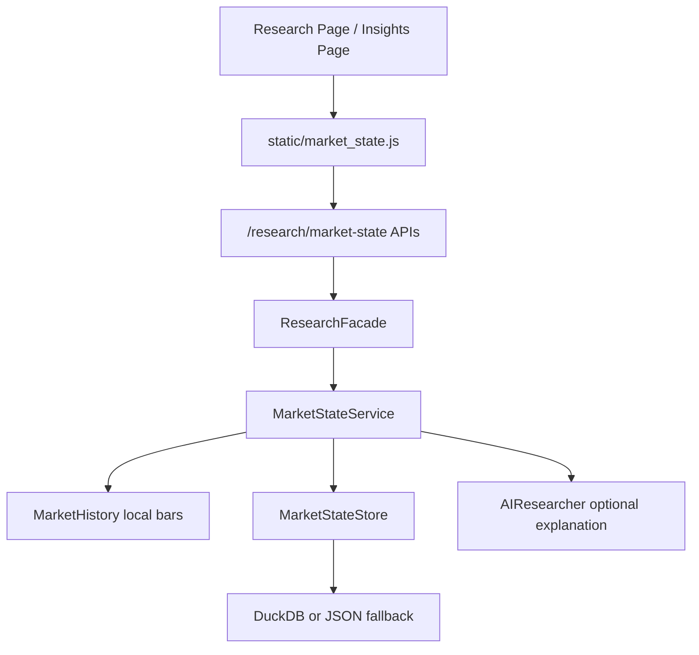

# TradingCat 市场结构快照与盘中时间线改造说明

本文档用于给 DeepSeek v4、Opus 或其他 reviewer 快速审查本次改造。重点不是说明产品愿景，而是把代码改动、边界、安全约束、验证结果和需要重点 review 的问题写清楚。

## 1. 背景与目标

本次改造来自“借鉴截图里的合理功能，不照搬界面和结论”的计划。实现目标是把截图中有价值的研究能力转成 TradingCat 自己的只读研究模块：

- 市场状态快照：给出市场结构、风险分、置信度、关注/回避分组和证据链。
- 盘中时间线：记录同一交易日多次研究快照，并比较相邻节点变化。
- AI 研究解释：AI 只能翻译结构化 evidence，不能生成交易动作。
- 前端展示：研究页展示当前快照，洞察页展示盘中演变。

明确不做：

- 不生成买入/卖出/仓位/下单价格。
- 不触发订单、审批、撤单、执行、对账链路。
- 不改变现有风险引擎和交易策略决策。
- 不实现 PCA/聚类第二阶段。

## 2. 本次主要新增文件

- `tradingcat/services/market_state.py`
  - 新增 `MarketStateService`。
  - 负责计算市场结构快照、生成 evidence、保存快照、读取时间线、比较相邻节点、生成模板/AI 研究解释。

- `tradingcat/repositories/market_state_store.py`
  - 新增 `MarketStateStore` facade。
  - 支持 DuckDB 持久化；不可用时回退 JSON：`data/market_state_snapshots.json`。

- `static/market_state.js`
  - 新增研究页快照 widget 和洞察页时间线 widget。
  - 负责调用 API、渲染指标卡、分组、证据表、数据质量提示和时间线节点。

- `tests/test_market_state.py`
  - 覆盖完整数据、缺失数据、时间线变化、AI 交易指令过滤、研究接口只读边界。

- `docs/market_state_review.md`
  - 即本文档。

## 3. 本次主要修改文件

- `tradingcat/domain/models.py`
  - 新增 domain models：
    - `MarketStateEvidence`
    - `MarketStateGroupSignal`
    - `MarketStateSnapshot`
    - `MarketStateTimelinePoint`

- `tradingcat/runtime.py`
  - 注入 `MarketStateStore` 和 `MarketStateService`。

- `tradingcat/app.py`
  - 增加 `market_state` property。

- `tradingcat/facades.py`
  - `ResearchFacade` 增加：
    - `market_state(...)`
    - `run_market_state(...)`
    - `market_state_timeline(...)`
  - 另外修正了 `_trading_plan_summary` 中 `market_awareness_snapshot` 覆盖 archived plan stale metrics 的问题；这是为了让现有 dashboard facade 测试在当前行为下通过。

- `tradingcat/routes/research.py`
  - 增加研究接口：
    - `GET /research/market-state?market=CN&as_of=...&include_ai=false`
    - `GET /research/market-state/timeline?market=CN&session_date=YYYY-MM-DD`
    - `POST /research/market-state/run?market=CN&as_of=...&session_tag=...&include_ai=false`
  - route 保持薄层，只做参数解析和 facade 调用。

- `tradingcat/services/ai_researcher.py`
  - 新增 `AIFeature.MARKET_STATE`。
  - 新增 `explain_market_state(...)` 和 `explain_insight_evidence(...)`。
  - prompt 明确要求只做研究解释，不给交易动作。

- `tradingcat/routes/insights.py`
  - 洞察详情不再懒生成/persist `TradingRecommendation`。
  - 改为 `_research_explanation`，内容为模板解释或 AI 研究解释。

- `static/api.js`
  - 新增：
    - `researchMarketState`
    - `researchMarketStateRun`
    - `researchMarketStateTimeline`

- `static/dashboard_insight_detail.js`
  - 把原“交易建议”渲染改成“研究解释”渲染。

- `templates/research.html`
  - 增加“市场结构快照”模块。
  - 引入 `static/market_state.js`。

- `templates/insights.html`
  - 增加“盘中市场结构时间线”模块。
  - 引入 `static/market_state.js`。

- `templates/insight_detail.html`
  - 文案从“交易建议”改为“研究解释”。

- `templates/base.html`
  - `dashboard.css` 增加版本 query，用于避免本地浏览器缓存旧 CSS。

- `static/dashboard.css`
  - 修复 `dashboard-grid` 在移动宽度下被长内容撑宽的问题。
  - `dashboard-grid` 改为 `grid-template-columns: minmax(0, 1fr)`。
  - `.panel` 增加 `min-width: 0`。
  - 市场结构模块相关卡片允许换行。
  - 480px 以下四列/六列卡片改为单列，避免横向溢出。

说明：当前工作区还有一些本次开始前就存在的 modified/untracked 文件，例如 `static/components.js`、`templates/briefing.html`、`static/assets/` 等。本文档只描述市场结构改造相关内容，不把这些既有脏改动归入本次功能设计。

## 4. Public Interfaces

### 4.1 `GET /research/market-state`

用途：读取某市场当前或最近可得的结构化研究快照。

参数：

- `market`: `CN | HK | US`，默认 `CN`
- `as_of`: 可选，ISO datetime
- `include_ai`: 可选，默认 `false`

返回核心字段：

```json
{
  "market": "CN",
  "session_date": "2026-04-28",
  "observed_at": "2026-04-28T14:20:49.507667Z",
  "session_tag": "afternoon",
  "bias_label": "risk_off",
  "risk_score": 8,
  "confidence": 100,
  "absolute_view": {
    "median_return_pct": -0.0081,
    "breadth_ratio": 0.25,
    "benchmark_return_pct": -0.0025,
    "usable_instrument_count": 4,
    "universe_count": 4
  },
  "relative_view": {
    "benchmark": "510300",
    "relative_strength_pct": -0.0056,
    "style_hint": "index_led_or_weak_internal"
  },
  "focus_groups": [],
  "avoid_groups": [],
  "evidence": [],
  "blockers": []
}
```

### 4.2 `POST /research/market-state/run`

用途：手动刷新一个研究快照，并持久化到 market-state store。

重要边界：

- 只刷新研究快照。
- 不调用 execution、orders、approvals、cancel、reconcile。
- 默认 `include_ai=false`，避免刷新时引入不必要 AI 延迟。

### 4.3 `GET /research/market-state/timeline`

用途：读取某市场某交易日的快照时间线。

参数：

- `market`: `CN | HK | US`，默认 `CN`
- `session_date`: 可选，默认当前交易日

返回：

- `points`: 按 `observed_at` 升序排列。
- 每个点包含 `changed_from_previous` 和 `changes`。

## 5. 计算规则概要

第一版只使用本地已有/容易计算的数据：

- 研究股票池：来自 `market_history.research_universe(...)`。
- 行情：通过 `bars_for_instrument(..., fetch_missing=False)` 读取本地历史，不主动补拉网络数据。
- 中位涨跌：研究池最近一个有效交易日收益中位数。
- 市场广度：收涨样本占比。
- 基准表现：CN 默认使用 `510300` 作为 CSI300 代理。
- 相对强弱：个股中位数减去基准涨跌。
- 风险结构：研究池年化波动、基准 20 日回撤。
- 分组：根据 instrument metadata 的 sector/theme/group 聚合，生成 focus/avoid。
- 数据质量：缺失、样本不足、无基准、无本地 bars 会进入 `blockers` 并降低 confidence。

输出约束：

- `risk_score`: 0-10，越高越防御。
- `confidence`: 只代表数据质量和证据一致性，不代表预测确定性。
- `bias_label`: 由收益、广度、相对强弱和风险结构综合规则决定。
- `evidence`: 每个标签都必须能追溯到一条或多条 evidence。

## 6. AI 安全边界

AI 只允许生成：

- 一句话摘要。
- 为什么值得观察。
- 支撑证据。
- 冲突证据。
- 下一次观察条件。
- 数据质量限制。

AI 禁止生成：

- 买入、卖出。
- 仓位比例。
- 下单价格。
- 止损/目标价。
- 审批建议。
- 执行建议。
- 自动调仓建议。

实现措施：

- prompt 明确 `research_only`。
- `MarketStateService._filter_ai_text(...)` 会过滤明显交易指令词，包括：
  - `买入`
  - `卖出`
  - `加仓`
  - `减仓`
  - `下单`
  - `止损`
  - `目标价`
  - `入场`
  - `仓位`
  - `approve`
  - `order`
- 洞察详情 route 改为返回 `_research_explanation`，不再生成 `TradingRecommendation`。

Reviewer 应重点检查：

- 过滤是否过宽或过窄。
- 是否仍有路径调用旧的 `analyze_insight_trading_action(...)`。
- 前端是否还有残留“交易建议”文案。

## 7. 数据流



关键点：

- 前端只调用 research API。
- route 不直接拼复杂逻辑。
- service 不触发执行链路。
- store 保存结构化 snapshot，不把完整 AI 长文作为主数据。

## 8. 前端展示检查

研究页：

- URL: `/dashboard/research`
- 新模块：`#market-state-widget`
- 展示：
  - 市场切换
  - 刷新快照
  - 市场、结构、风险、置信度、更新时间
  - 绝对结构、相对结构、观察解释
  - 关注/回避分组
  - evidence 表
  - blockers 或数据质量提示

洞察页：

- URL: `/dashboard/insights`
- 新模块：`#market-state-timeline-widget`
- 展示：
  - 市场切换
  - 刷新快照
  - 快照数量
  - 时间线节点
  - 风险/置信度
  - 关注/回避标签
  - 和上一节点的变化
  - 前 3 条 evidence

本次浏览器检查发现并已修复：

- 移动宽度下 `dashboard-grid` 被长内容撑宽。
- 市场结构卡片在 390px 宽度下横向溢出。
- 时间线时间在默认 locale 下显示成英文格式。

## 9. 已执行验证

编译：

```bash
.venv/bin/python -m compileall tradingcat/domain/models.py tradingcat/services/market_state.py tradingcat/repositories/market_state_store.py tradingcat/routes/research.py tradingcat/services/ai_researcher.py tradingcat/routes/insights.py tradingcat/runtime.py tradingcat/app.py tradingcat/facades.py
```

专项测试：

```bash
.venv/bin/python -m pytest tests/test_market_state.py -q
```

结果：

```text
5 passed
```

相关回归子集：

```bash
.venv/bin/python -m pytest tests/test_market_state.py tests/test_market_awareness_service.py tests/test_dashboard_facade.py tests/test_nav_fallback.py tests/test_api.py::test_research_market_awareness_falls_back_to_degraded_payload_on_failure -q
```

结果：

```text
31 passed
```

API smoke：

```bash
curl -sS 'http://127.0.0.1:8001/research/market-state?market=CN'
curl -sS -X POST 'http://127.0.0.1:8001/research/market-state/run?market=CN'
curl -sS 'http://127.0.0.1:8001/research/market-state/timeline?market=CN'
```

结果：

- 均返回 HTTP 200。
- 手动刷新未再卡在旧的全量 market awareness 路径。

浏览器/布局验证：

- 服务运行在 `http://127.0.0.1:8001`。
- 390px 宽度：
  - `/dashboard/research`: `scrollWidth == innerWidth == 390`
  - `/dashboard/insights`: `scrollWidth == innerWidth == 390`
  - 无 JS console error。
  - 无“交易建议”文案。
- 1280px 宽度：
  - 两页均 `scrollWidth == innerWidth == 1280`
  - 无 JS console error。

## 10. 已知风险与待审查点

### 10.1 完整 API 测试当前不干净

单独跑完整 `tests/test_api.py` 时，在当前本地状态下有既有/环境相关失败，例如：

- scheduler job 数量和测试期望不一致。
- 部分手动订单测试返回 422。
- Futu kline 限流导致报告 fallback。
- dashboard 页面旧断言不匹配。

这些不是本次市场结构路径专项测试的失败，但 reviewer 可进一步确认是否有真实回归。

### 10.2 本地 Futu 依赖导致 pytest 进程有时不自然退出

测试输出已经完成并显示 passed，但本地 Futu/network thread 可能让 pytest 进程滞留。验证时我在结果输出后手动停止了对应 pytest 进程。

### 10.3 `include_ai=true` 的延迟与失败策略

默认接口不启用 AI。若 reviewer 打开 `include_ai=true`，应重点检查：

- AI provider 不可用时是否平稳降级。
- AI 输出是否被过滤。
- AI 解释是否不会覆盖结构化证据。

### 10.4 分组信号样本数较小

当前本地 CN 样本只有少量标的时，focus/avoid 分组可能只有 1-2 个样本。第一版允许这样展示，但 confidence/evidence 应反映数据质量。Reviewer 可判断是否需要最小样本阈值更严格。

### 10.5 CSS 改动有全局影响

`dashboard-grid` 和 `.panel { min-width: 0 }` 是全局修复，目的是防止所有 dashboard 页面被长内容撑宽。Reviewer 应检查其它页面是否依赖旧的内容撑宽行为。

## 11. 建议 reviewer 重点看这些问题

1. 安全边界是否完整：是否有任何路径会从研究快照进入交易、审批、撤单、执行、对账。
2. route 是否足够薄：复杂逻辑是否都在 service/facade，而不是 route。
3. evidence 可审计性：每个 `bias_label`、`risk_score`、`confidence` 是否能从 evidence/blockers 解释。
4. 缺数据降级：没有本地 bars、样本不足、无基准时是否稳定返回 blockers 而不是抛异常。
5. AI 解释：prompt 和后置过滤是否足够避免交易动作输出。
6. 前端文案：是否还有“交易建议”或类似会被误解为可执行建议的表达。
7. 移动布局：证据表、时间线节点、长分组名是否会导致横向溢出。
8. 持久化：DuckDB/JSON fallback 的 upsert/list/latest 行为是否适合后续多市场、多交易日使用。

## 12. 当前服务地址

本地服务当前运行在：

- `http://127.0.0.1:8001/dashboard/research`
- `http://127.0.0.1:8001/dashboard/insights`

启动时使用了安全模式：

```bash
TRADINGCAT_FUTU_ENABLED=false TRADINGCAT_RELOAD=false .venv/bin/uvicorn tradingcat.main:app --host 127.0.0.1 --port 8001
```

